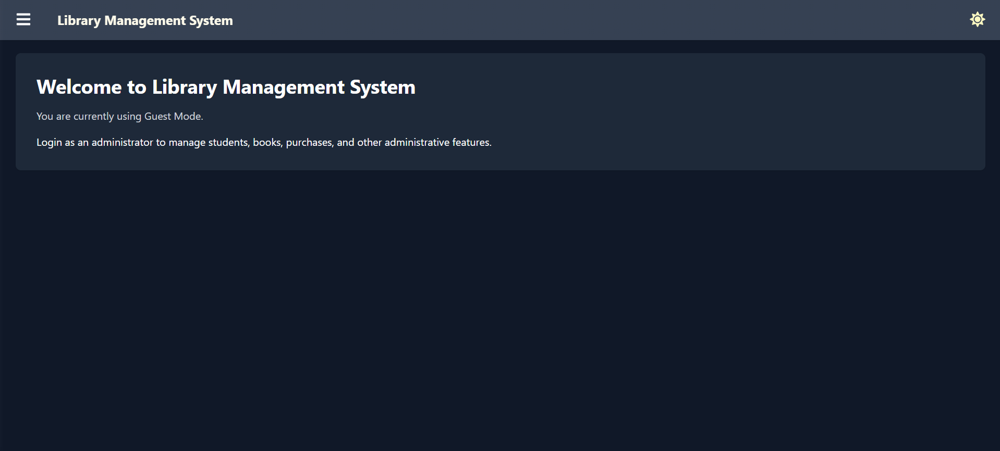
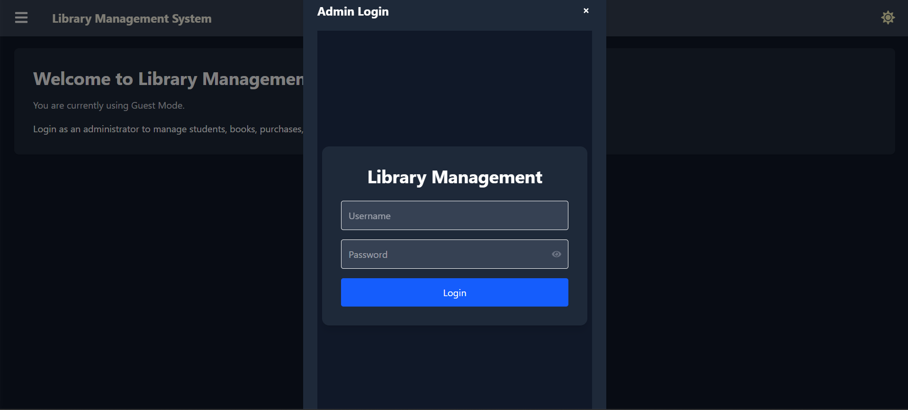
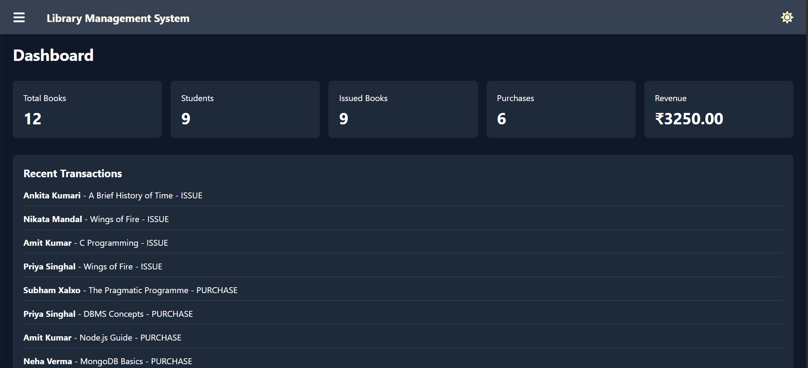
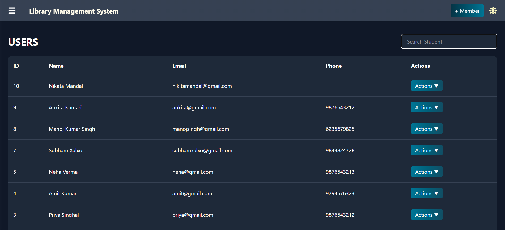
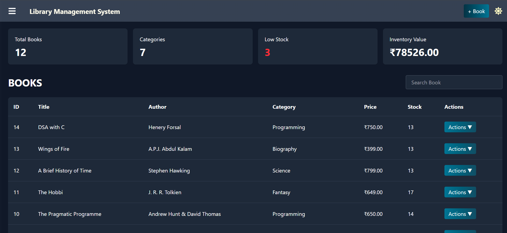
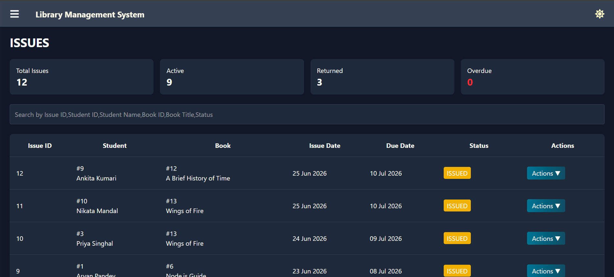
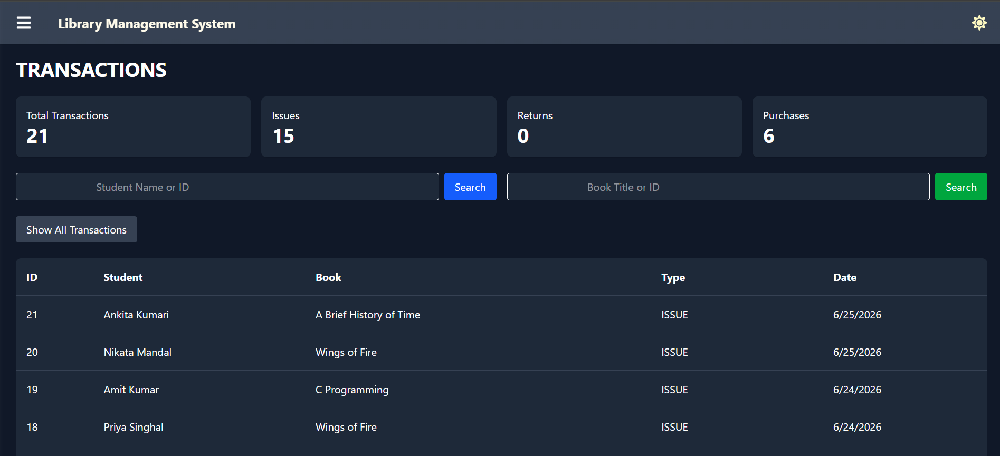
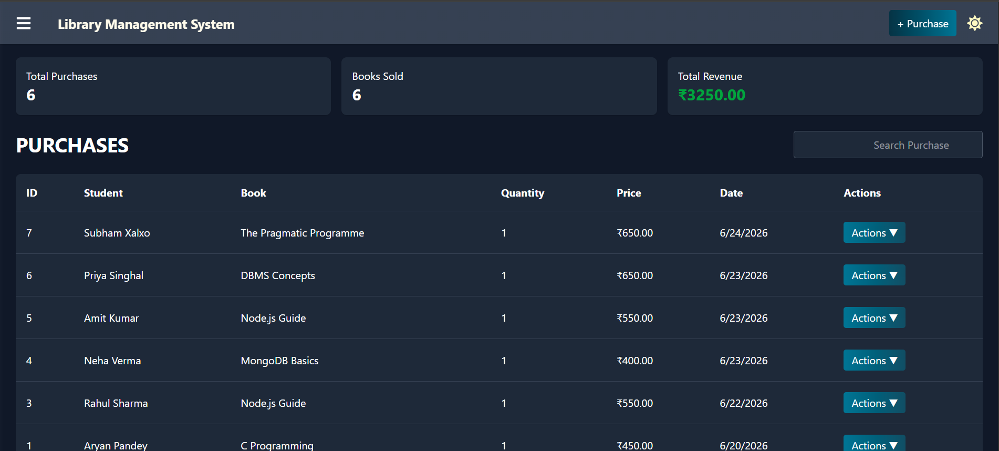

# 📚 Library Management System

A full-stack **Library Management System** built using **React, Node.js, Express, MySQL, and JWT Authentication**. The application allows administrators to manage books, students, book issues, returns, purchases, and transactions through a secure admin dashboard, while guests can view public information.

---

## ✨ Features

### 👤 Guest Features

* View Home Dashboard
* View Issued Books
* View Transaction History
* Secure Admin Login

### 🔐 Admin Features

* Dashboard with statistics
* Student Management

  * Add Student
  * Edit Student
  * Delete Student
  * Student Issue History
* Book Management

  * Add Book
  * Edit Book
  * Delete Book
  * Book Issue History
* Issue Books
* Return Books
* Purchase Books
* Transaction History
* Change Password
* Dark / Light Mode
* Responsive Sidebar
* JWT Authentication
* Protected Routes

---

## 🛠 Tech Stack

### Frontend

* React
* Vite
* Tailwind CSS
* Axios
* React Icons

### Backend

* Node.js
* Express.js
* JWT Authentication

### Database

* MySQL

---

## 📂 Project Structure

```text
Library-Management-System
│
├── frontend/frontend 
│   ├── src
│   ├── public
│   └── package.json
│
├── backend
│   ├── controllers
│   ├── routes
│   ├── middleware
│   ├── config
│   └── server.js
│
└── README.md
```

---

## 🚀 Installation

### Clone Repository

```bash
git clone https://github.com/A-Pandey-IT/Library-Management-System.git
```

### Backend

```bash
cd backend
npm install
npm start
```

### Frontend

```bash
cd frontend
npm install
npm run dev
```

---

## 📸 Screenshots

📸 Screenshots

### Guest Dashboard



---

### Login



---

### Admin Dashboard



---

### Users



---

### Books



---

### Issues



---

### Transactions



---

### Purchase



---

## 🔒 Authentication

This project uses **JWT (JSON Web Token)** for secure authentication.

Only authenticated administrators can:

* Manage students
* Manage books
* Purchase books
* Return books
* Change password

Guests can only access public pages.

---

## 🚧 Future Improvements

* Export Reports (PDF / Excel)
* Dashboard Charts
* Email Notifications
* Barcode / QR Code Support
* Book Cover Images
* Student Profile Images
* Automatic Fine Reports

---

## 👨‍💻 Author

**Aryan Pandey**

GitHub: https://github.com/A-Pandey-IT
